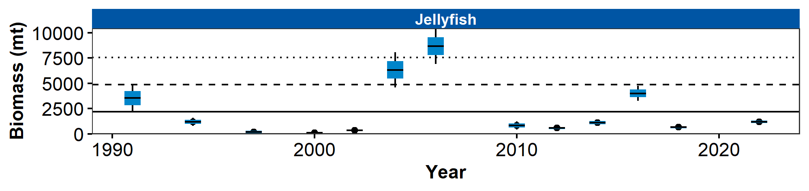

```{r setup, include=FALSE}
library(esrindex)
library(knitr)
```

Contributed by Ned Laman
Resource Assessment and Conservation Engineering Division, Alaska Fisheries Science Center, NOAA Fisheries 

**Contact**: Ned.Laman@noaa.gov

**Last updated**: October 2022

**Description of Indicator**: The RACE Groundfish Assessment Program (GAP) bottom trawl surveys in the Aleutian Islands (AI) are designed primarily to assess populations of commercially important fish and invertebrates. However, many other species are identified, weighed, and counted during the course of these surveys and these data may provide a measure of relative abundance for some of these species. Jellyfish are likely not sampled thoroughly and in a representative manner by our trawl gear due to their fragility and potential for catch in the mid-water during net deployment or retrieval. Therefore, jellyfish encountered in our trawl catches may or may not reflect their true abundance in the AI. The fishing gear used aboard the Japanese vessels that participated in all AI surveys prior to 1990 was very different from the gear used by all vessels since and likely influenced jellyfish catch rates on those surveys. Jellyfish catches in each year were scaled to the largest catch over the time series (which was arbitrarily scaled to a value of 100). The standard error (±1 SE) was weighted proportionally to the catch per unit effort (CPUE) to produce a relative SE. The percentage of catches with jellyfish present in the survey bottom trawl hauls was also calculated.

**Status and Trends**: Jellyfish mean CPUE is typically higher in the western and eastern AI than in other areas (Figure 27). The frequency of jellyfish occurrence in trawl catches is generally from 20–60% across all areas, but has been variable. The 2006 AI survey experienced peak biomasses in all survey areas, whereas the 1992 survey had high abundance in the western AI only. Jellyfish CPUE and frequency of occurrence increased in 2022 relative to 2018. Frequency of jellyfish occurrence in trawl catches in 2022 exceeds that of the next highest previous survey (2016), but mean CPUE in 2022 remains below the 2016 CPUE levels.

**Factors influencing observed trends**: Unknown

**Implications**: The 2022 increase in CPUE and frequency of occurrence of jellyfish is in contrast to the decline in occurrence and abundance between 2016 and 2018. Some of the warmest mean temperatures recorded on our AI surveys occurred in 2016 and 2018. While water temperatures were relatively cooler in 2022, the mean surface and bottom temperatures measured at the trawl net remained above the long term 20-year average. Temperatures are also indicative of water flow in the AI, where water movement is directly influenced by the Aleutian Passes so that it is difficult to attribute any one environmental factor to the patterns observed in jellyfish CPUE and occurrence.


```{r fig1, include = TRUE, echo = FALSE, fig.cap='\\label{fig:figs}Figure 1. Relative mean CPUE of jellyfish species by INPFC area from RACE Groundfish Assessment Program bottom trawl surveys in the Aleutian Islands from 1980 through 2022. Error bars represent relative standard errors. The gray lines represent the percentage of non-zero catches.'}

```

## References
