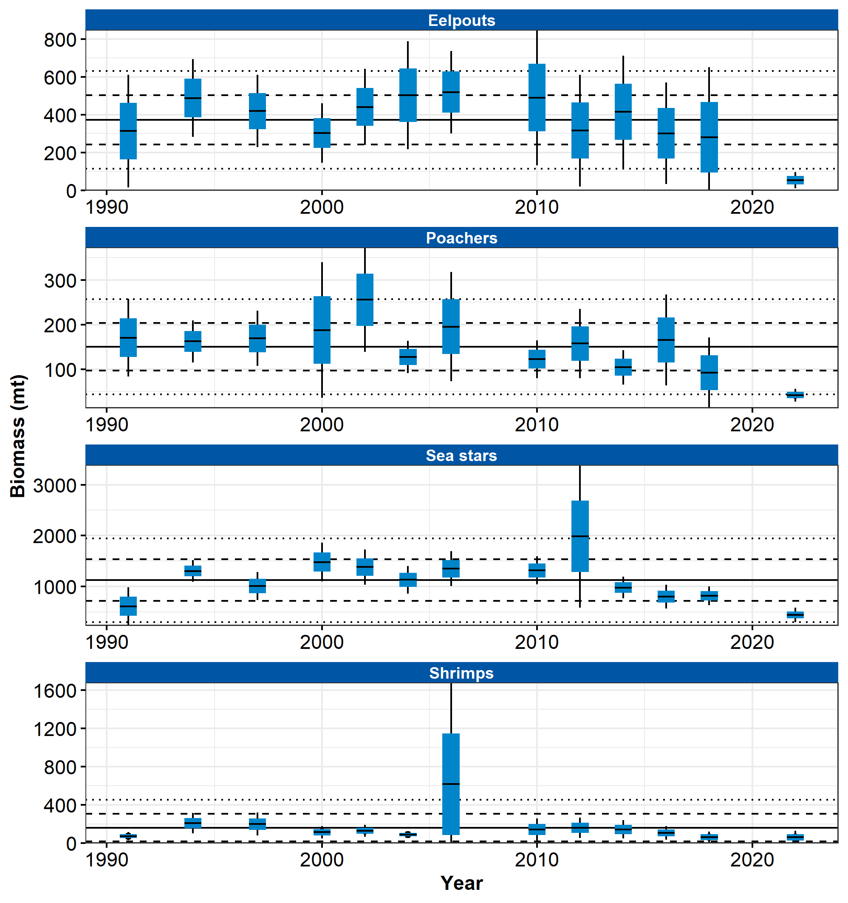
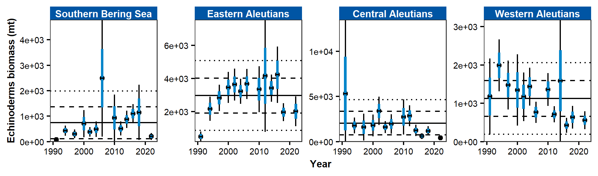

```{r setup, include=FALSE}
library(esrindex)
library(knitr)
```

Contributed by Ned Laman
Resource Assessment and Conservation Engineering Division, Alaska Fisheries Science Center, NOAA Fisheries 

**Contact**: Ned.Laman@noaa.gov

**Last updated**: October 2022

**Description of Indicator**: RACE bottom trawl surveys in the Aleutian Islands (AI) are designed primarily to assess populations of commercially important fish and invertebrates. However many other species are identified, weighed and counted during the course of these surveys and these data may provide a measure of relative abundance for some of these species. Many of these species are not sampled well by the gear or occur in areas that are not well sampled by the survey (hard, rough areas, mid-water etc.) and are therefore encountered in small numbers which may or may not reflect their true abundance in the AI. The fishing gear used aboard the Japanese vessels that participated in all AI surveys prior to 1991 was very different from the gear used by all vessels since. This gear difference almost certainly affected the catch rates for some of these species groups. Apparent abundance trends for a few of these groups are shown in Figure 36. For each species group, the largest catch over the time series was arbitrarily scaled to a value of 100 and all other values were similarly scaled. The standard error (± 1) was weighted proportionally to the CPUE to get a relative standard error.

**Status and Trends**: Echinoderms are frequently captured in all areas of the AI survey, occurring in 80–90% of all bottom trawl hauls. Echinoderm mean CPUE is typically higher in the central and eastern AI than in other areas, although frequency of occurrence in trawl catches is consistently high across all areas. Echinoderm CPUE has been stable in the western and eastern Aleutians since 2018 and declined in the central Aleutians and southern Bering Sea in 2022. Eelpout CPUEs have been stable and low in the western Aleutians and southern Bering Sea, but declined in 2022 in the central and eastern Aleutians. Eelpouts generally occur in <10% of survey hauls across all areas. Poachers occur in a relatively large number of tows across the AI survey area (about 30–40% consistently), but mean CPUE trends are unclear and abundance appears low. A shrimp time series has been calculated since 2016 that shows a variable pattern of abundance through time. Shrimp CPUE in 2022 was lower in the western AI, low and similar to abundance in 2018 in the central and eastern Aleutians, and appeared to increase in the southern Bering Sea.

**Factors influencing observed trends**: Unknown

**Implications**: AI survey results provide limited information about abundance or abundance trends for these species due to problems in catchability. Therefore, the indices presented are likely of limited value to fisheries management. These species are not typically commercially important, but the trends in shrimp especially should be monitored as these are an important prey base for benthic commercial species.


```{r fig1, include = TRUE, echo = FALSE, fig.cap='\\label{fig:figs}Figure 1. AI miscellaneous species'}

```

```{r fig2, include = TRUE, echo = FALSE, fig.cap='\\label{fig:figs}Figure 2. AI Echinoderms'}

```

## References
