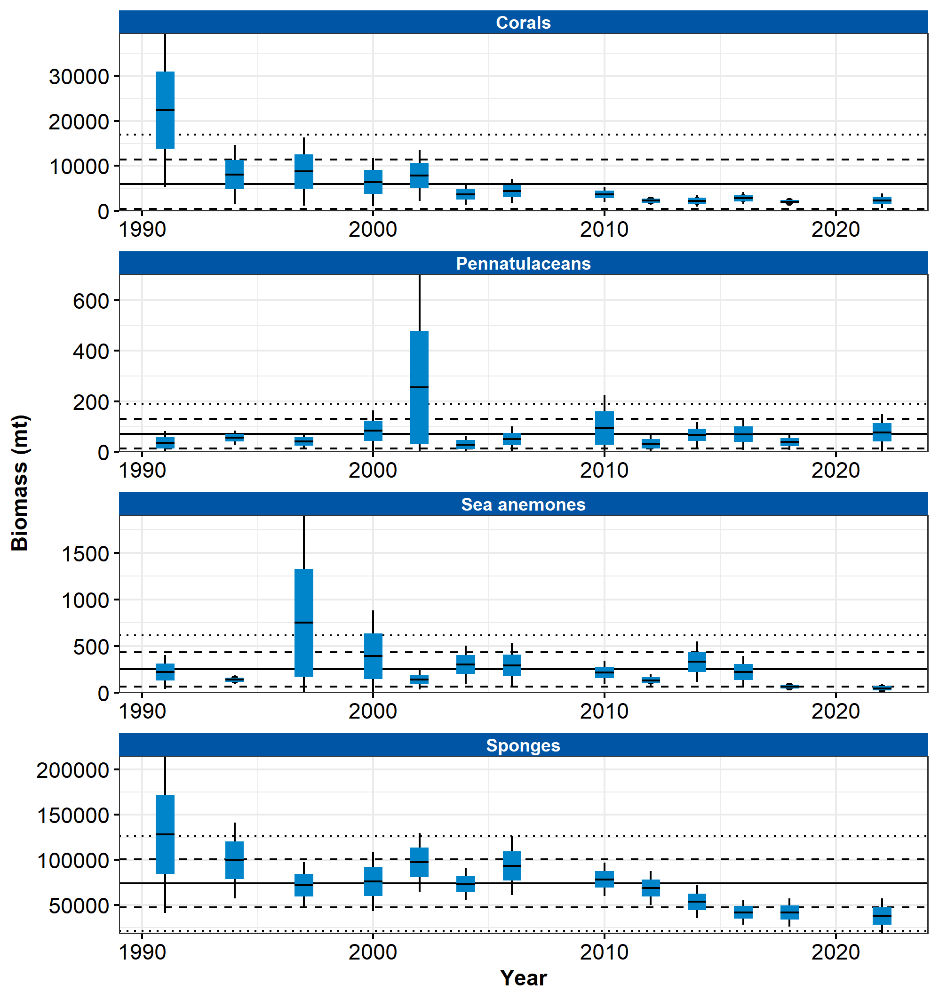

```{r setup, include=FALSE}
library(esrindex)
library(knitr)
```

Contributed by Ned Laman

Resource Assessment and Conservation Engineering Division, Alaska Fisheries Science Center, NOAA Fisheries 

**Contact**: Ned.Laman@noaa.gov

**Last updated**: October 2022

**Description of Indicator**: Biota considered to be Habitat Areas of Particular Concern (HAPC) are structural epifauna that include groups of seapens/seawhips, corals, anemones, and sponges. The biennial RACE Groundfish Assessment Program (GAP) bottom trawl survey in the Aleutian Islands (AI) does not sample the density of HAPC fauna well, but does seem to capture spatial trends in presence or absence in areas surveyed (Rooper, et al., 2016; Rooper, et al., 2018). Survey effort in rough or rocky areas where these groups are likely to be more abundant is limited. The gears used by the Japanese vessels in the surveys prior to 1991 were quite different from the survey gear used aboard U.S. vessels in subsequent surveys, and so likely resulted in different catch rates for many of these groups. For each taxonomic group, the largest catch over the time series was arbitrarily scaled to a value of 100 and all other values were scaled to it. The standard error (±1) was weighted proportionally to the CPUE to get a relative standard error. Sponges include unidentified Porifera, calcareous sponges, hexactinellid sponges, and demosponges, which are the most common and abundant sponges within this larger grouping. Gorgonians include families of upright branching coral (Primnoidae, Plexauridae, Isididae, etc.). Hydrocorals include stylasterid corals and stony corals. Soft corals are uncommon in the AI bottom trawl survey catches, but are represented by genera like Gersemia. Sea anemones include all sea anemones captured in the bottom trawl surveys and pennatulaceans include sea pens and sea whips.

**Status and Trends**: A few general patterns are clearly discernible (Figure 26). Sponges are caught in most tows >80%) in the AI west of the southern Bering Sea. Interestingly, the frequency of occurrence of sponges in the southern Bering Sea is relatively high, but sponge abundance is much lower there than to the west. The sponge estimates for the 1983 and 1986 surveys are much lower than other years. This lower sponge estimate is likely due to (1) the use of different gear in those years, including large tire gear that limited the catch of most sponges and (2) to inconsistencies in the resolve to identify and quantify sponges at that time. Sponge abundance began declining in the Aleutians west of the southern Bering Sea in 2010, but appears to have begun stabilizing in recent years (2016–2022). Gorgonian corals occur in about 20–40% of AI bottom trawl survey tows. Abundance of coral in all areas has declined since about 1991–1993 and is at generally low levels in all areas, but the frequency of occurrence has remained steady. Hydrocorals are fairly commonly captured, except in the southern Bering Sea. They typically occur in about 20–40% of tows in other areas in the AI. Similar to sponges, hydrocoral frequency of occurrence and abundance has decreased in the western and central AI over recent surveys (from a peak in the 2000 survey). The 2022 results suggest declines in the eastern and central Aleutians and a slight increase in the western Aleutians. Soft corals occur in relatively few tows, except in the eastern AI where they occur in about 20% of tows. Their abundance time series is dominated by a couple of years (1986 in the western Aleutians and 1991 in the central Aleutians). Sea anemones are also relatively common in survey catches (∼20–40% of tows) but abundance trends are not clear for most areas. In the southern Bering Sea, abundance and frequency of occurrence of sea anemones in 2022 appears to be declining (western, central, and eastern Aleutians) or has stabilized at very low levels (southern Bering Sea). Sea pens are much more likely to be encountered in the southern Bering Sea and eastern AI than in areas farther west. Abundance estimates are low across the survey area. Any large apparent increases in abundance, such as that seen in the eastern AI in 1997, are typically based on a single large 52 catch. In 2022, there were slight increases in the abundance of sea pens in the eastern AI and southern Bering Sea.

**Factors influencing observed trends**: The two major threats to populations of benthic invertebrates in the AI have been identified as fishing impacts and impacts of climate change (Rooper et al. 2018). Both of these processes are occurring in the Aleutian archipelago. Much of the benthic habitat in the Aleutians (∼ 50% of the shelf and slope to depths of 500 m) has been protected from mobile fishing gear since 2006, however, no studies have been conducted to determine potential recovery or expansion of populations due to the closures. As indicated by the 2022 bottom trawl survey, temperature time series (O’Leary, page 43), temperatures for the last four biennial surveys have been warmer than long-term historical averages. Non-motile HAPC organisms are sensitive to these changes in the benthic environment.

**Implications**: The two major threats to populations of benthic invertebrates in the AI have been identified as fishing impacts and impacts of climate change (Rooper et al. 2018). Both of these processes are occurring in the Aleutian archipelago. Much of the benthic habitat in the Aleutians (∼ 50% of the shelf and slope to depths of 500 m) has been protected from mobile fishing gear since 2006, however, no studies have been conducted to determine potential recovery or expansion of populations due to the closures. As indicated by the 2022 bottom trawl survey, temperature time series (O’Leary, page 43), temperatures for the last four biennial surveys have been warmer than long-term historical averages. Non-motile HAPC organisms are sensitive to these changes in the benthic environment.


```{r fig1, include = TRUE, echo = FALSE, fig.cap='\\label{fig:figs}Figure 1.  Mean CPUE of structural epifauna that form Habitat Areas of Particular Concern by area from RACE Groundfish Assessment Program bottom trawl surveys in the Aleutian Islands from 1980 through 2022. Error bars represent standard errors. The gray lines represent the percentage of non-zero catches.'}

```


## References
