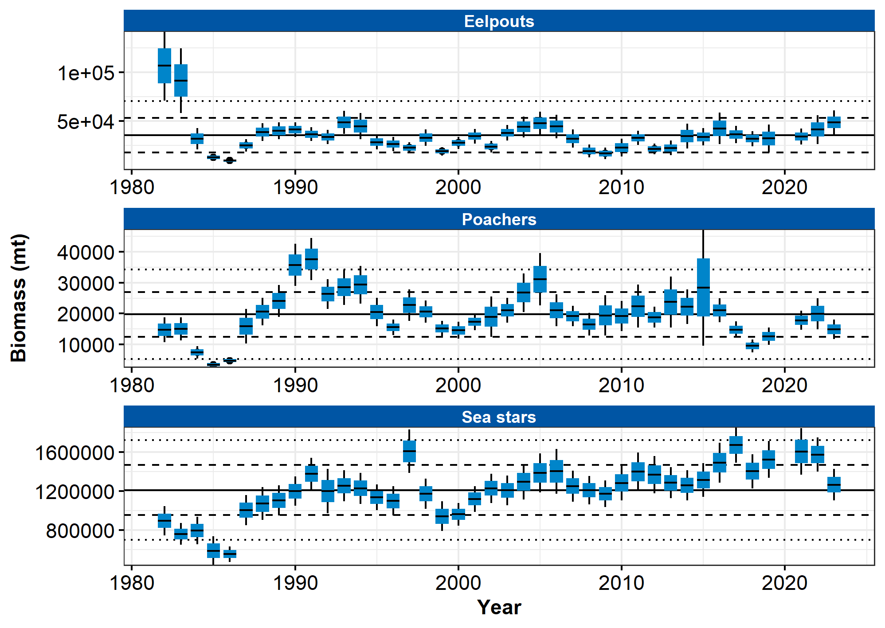
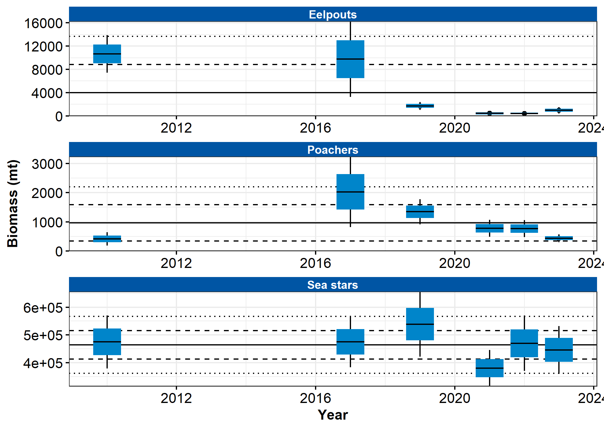

```{r setup, include=FALSE}
library(esrindex)
library(knitr)
```

Contributed by Thaddaeus Buser
Resource Assessment and Conservation Engineering Division, Alaska Fisheries Science Center National Marine Fisheries Service, NOAA 

**Contact**: thaddaeus.buser@noaa.gov

**Last updated**: September 2023

**Description of Indicator**: 'Miscellaneous' species fall into three groups: eelpouts (fshes of the Family Zoarcidae), poachers (fshes of the Family Agonidae), and sea stars (Class Asteroidea). The three species comprising the bulk of the eelpout group are the wattled eelpout (Lycodes palearis) and shortfn eelpout (L. brevipes) and to a lesser extent the marbled eelpout (L. raridens). The biomass of poachers is dominated by the sturgeon poacher (Podothecus acipenserinus) and to a lesser extent the sawback poacher (Leptagonus frenatus). The composition of sea stars is dominated by the purple-orange sea star (Asterias amurensis), found primarily in the inner/middle shelf, and the common mud star (Ctenodiscus crispatus), primarily in the outer shelf. Relative CPUE by weight (kg per hectare) was calculated and plotted for each species or species group by year for 1982–2023 for the eastern Bering Sea survey and 2010–2023 for the northern Bering Sea survey. Catch methods for the northern Bering Sea were standardized in 2010, so catches from previous years do not provide comparable data and are excluded. Relative CPUE was calculated by setting the largest biomass in the time series to a value of 1 and scaling other annual values proportionally. The standard error (±1) was weighted proportionally to the CPUE to produce a relative standard error.

**Status and Trends**: Eastern Bering Sea: The 2023 relative CPUE estimate for eelpouts showed a modest increase from 2022, just above the average of the estimates over the last 10 years. For poachers, CPUE decreased from 2022, returning to levels seen in 2017, ending a multi-year upward trend (2018–2021). The 2023 poacher estimate is just below the average for the time series. The CPUE for sea stars in 2023 also broke a multi-year upward trend (2017–2021), with the 2023 estimate returning to a level last seen in 2016 (Figure 95). Northern Bering Sea: The relative CPUE estimates for eelpouts are much higher before 2018 than after. Whether this indicates a trend is unclear given the gaps in sampling years. For poachers, the CPUE was likewise low after 2018, but it was also low in 2010, with 2017 being an outlier of high relative CPUE. The CPUE for sea stars is remarkably consistent across the time series, especially compared with all other groups in this report (Figure 96).

**Factors influencing observed trends**: It is difficult to identify trends, especially for the NBS given that survey has been conducted intermittently and only recently (i.e., starting in 2017) been conducted on a more regular schedule. Determining whether, for example, the low relative CPUE after 2018 in poachers (EBS and NBS) and eelpouts (NBS) represents real responses to environmental change or is an artifact of standardized survey sampling methodology (e.g., temperature dependent catchability) will require more specifc research on survey trawl gear selectivity relative to interannual diferences in bottom temperatures and on the life history characteristics of these epibenthic species.

**Implications**: Eelpouts have important roles in the energy fow within benthic communities. For example, eelpouts are a common prey item of arrowtooth founder (Atheresthes stomias). However, it is not known at present whether these changes in CPUE are related to changes in energy fow.


```{r fig1, include = TRUE, echo = FALSE, fig.cap='\\label{fig:figs}Figure 1. AFSC eastern Bering Sea shelf bottom trawl survey relative CPUE for miscellaneous fish species during the May to August time period from 1982–2023.'}

```

```{r fig2, include = TRUE, echo = FALSE, fig.cap='\\label{fig:figs}Figure 2. AFSC northern Bering Sea shelf bottom trawl survey relative CPUE for miscellaneous fsh species during the July to August time period from 2010–2023.'}

```

## References
