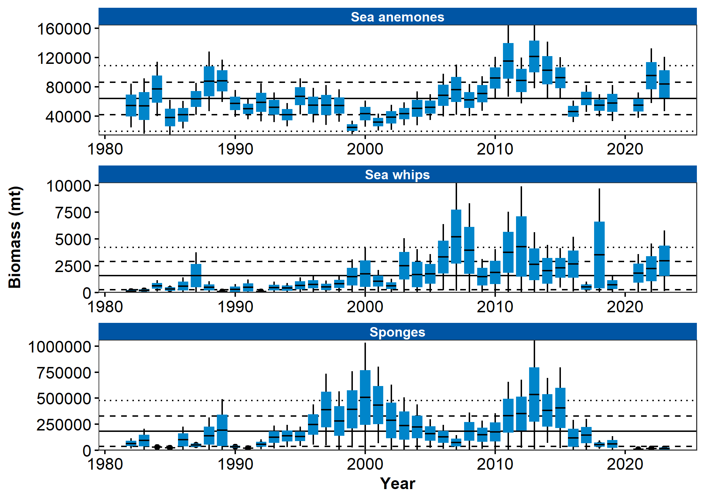
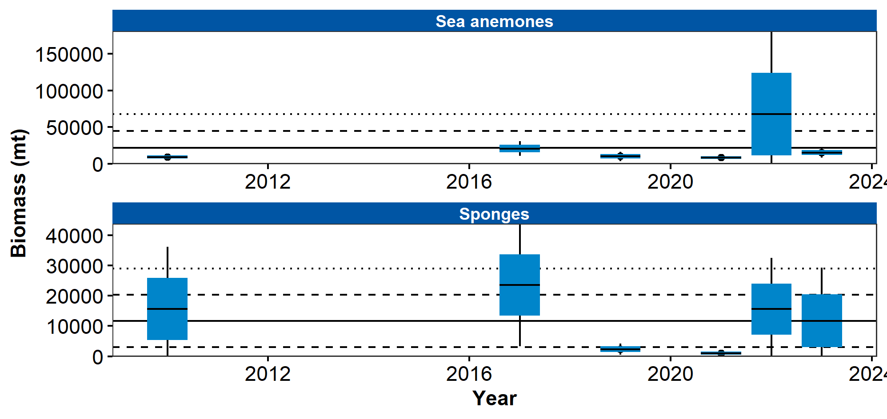

```{r setup, include=FALSE}
library(esrindex)
library(knitr)
```

Contributed by Thaddaeus Buser

Resource Assessment and Conservation Engineering Division, Alaska Fisheries Science Center National Marine Fisheries Service, NOAA 

**Contact**: thaddaeus.buser@noaa.gov

**Last updated**: September 2023

**Description of Indicator**: Groups considered to be structural epifauna include: sea whips, corals, anemones, and sponges. Corals are rarely encountered in the eastern or northern Bering Sea so they were not included here; sea whips are rarely encountered in the northern Bering Sea so they are only shown for the eastern Bering Sea shelf survey. Relative CPUE by weight (kg per hectare) was calculated and plotted for each species group by year for 1982–2023 for the eastern Bering Sea survey and for 2010–2023 for the northern Bering Sea survey. Catch methods for the northern Bering Sea were standardized in 2010, so the catches from previous years do not provide comparable data and are excluded. Relative CPUE was calculated by setting the largest biomass in the time series to a value of 1 and scaling other annual values proportionally. The standard error (±1) was weighted proportionally to the CPUE to produce a relative standard error.

**Status and Trends**: 

_Eastern Bering Sea:_

As in 2022, the relative catch rates for sea anemones (Actiniaria) were similar to those observed during 2010–2015, compared to lower catch rates observed from 2016–2021. Likewise, sea whip (Pennatulacea) estimates for 2023 are similar to those observed in 2021 and 2022, which together represent an increase from 2019 observations and a return to a catch rate similar to that observed 1999–2005 and 2013–2016. The catch rate of sponges (Porifera) in 2023 continues the very low catch level observed since 2021, which was the lowest level observed in the time series, but similar to results observed intermittently during the early years of the time series, 1984–1992. These trends should be viewed with caution because the consistency and quality of their enumeration have varied over the time series (Stevenson and Hof, 2009; Stevenson et al., 2016). Moreover, the identifcation of trends is uncertain given the large variability in relative CPUE (Figure 38).

_Northern Bering Sea:_

The relative catch rates of sea anemones are consistent across the time series except for 2022, which was much larger than all other years. This difers slightly from the trend observed in the eastern Bering Sea from 2010–2023, which showed relatively high catch rates from 2010–2013 and 2022–2023, with relatively low catch rates in between. The catch rate of sponges in the NBS is highly variable across the time series, with high relative catch rates 2010, 2017, 2022, and 2023 and low catch rates in 2019 and 2021 (Figure 39).

**Factors influencing observed trends**: It is difficult to identify trends, given that the NBS survey has been conducted intermittently and only recently (i.e., starting in 2017) been conducted on a more regular schedule. Further research in several areas would beneft the interpretation of structural epifauna trends including systematics and taxonomy of Bering Sea shelf invertebrates, survey gear selectivity, and the life history characteristics of the epibenthic organisms captured by the survey trawl.

**Implications**: Understanding the trends as well as the distribution patterns of structural epifauna is important for modeling habitat to develop spatial management plans for protecting habitat, understanding fshing gear impacts, and predicting responses to future climate change (Rooper et al., 2016). More research on the eastern Bering Sea shelf will be needed to determine if there are defnitive links.


```{r fig1, include = TRUE, echo = FALSE, fig.cap='\\label{fig:figs}Figure 1. AFSC eastern Bering Sea shelf bottom trawl survey relative CPUE for three groups of benthic epifauna during the May to August time period from 1982–2023.'}

```


```{r fig2, include = TRUE, echo = FALSE, fig.cap='\\label{fig:figs}Figure 2. AFSC northern Bering Sea shelf bottom trawl survey relative CPUE for two groups of benthic epifauna during the July to August time period from 2010–2023.'}

```


## References
