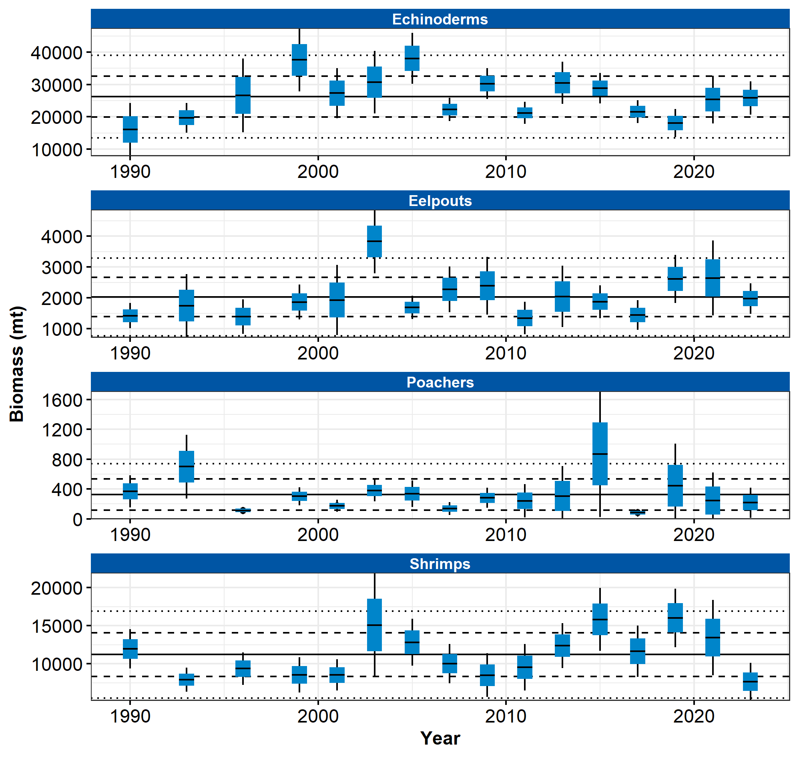

```{r setup, include=FALSE}
library(esrindex)
library(knitr)
```

Contributed by Ned Laman and Alexandra Dowlin

Resource Assessment and Conservation Engineering Division, Alaska Fisheries Science Center, NOAA Fisheries 

**Contact**: Ned.Laman@noaa.gov

**Last updated**: October 2023

**Description of Indicator**: The NOAA Fisheries’ Groundfish Assessment Program (RACE-GAP) fishery-independent summer bottom trawl surveys in the Gulf of Alaska (GOA) are designed to assess populations of commercially and ecologically important fishes and invertebrates. There are some species and taxonomic groups which occur commonly in survey catches or are of particular interest and which can provide additional context when assessing the status of the ecosystem; some of these are presented here. Since 1990, we have deployed the same standardized trawl gear (footrope and trawl net) as presently in use in the GOA bottom trawl survey. The taxonomic groups presented here are neither targeted by our survey nor are they ideal for collection by our standard trawl gear. Issues of selectivity, catchability, and retention affect the precision and accuracy of biomass estimates generated for these taxa so that any apparent trends should be interpreted with caution. Biomass estimates for these taxa were scaled to the largest estimate in the time series for each, and this value was then arbitrarily scaled to a value of 100 and all other values were scaled in reference to that. The standard error (± 1) was weighted proportionally to the biomass to yield a relative standard error. Prevalence in survey catches is also presented as the percentage of positive bottom trawl hauls for each taxon.

**Status and Trends**: Echinoderms and shrimp are relatively commonly caught in our survey catches, while eelpouts and poachers occur with less frequency (Figure 82). Echinoderm biomass has been highest in the Chirikof and Kodiak districts historically and appears to be increasing in the latter in recent surveys; this group of benthic invertebrates is common in trawl catches throughout the Gulf. Shrimp biomass has also historically been higher in the Chirikof and Kodiak districts than elsewhere in the Gulf, but appears to be declining in those two districts in recent surveys. Eelpouts occur episodically in catches throughout the GOA, but seem to be more abundant in the Yakutat district where their biomass may be increasing over the time series. Poachers are more common in the Shumagin district than elsewhere in the Gulf where they are uncommon and their highest biomass has historically occurred in the Shumagin and Kodiak districts.

**Factors influencing observed trends**: Unknown

**Implications**: It is difficult to discern a consistent pattern of biomass or prevalence across these taxonomic groups. There are some patterns within groups (e.g., echinoderms are common throughout the Gulf, eelpout biomass has cycled between highs and lows over the course of the time series and in most districts). Directed research into the population ecology of these taxonomic groups could help to elucidate relationships between their population status and the health of the region.


```{r fig1, include = TRUE, echo = FALSE, fig.cap='\\label{fig:figs}Figure 1. Relative biomass estimates of echinoderms, shrimps, eelpouts, and poachers collected from International North Pacific Fisheries Commission (INPFC) statistical districts during fishery-independent summer bottom trawl surveys of the Gulf of Alaska (1990–2023). Error bars represent standard errors and the gray lines represent the prevalence (percentage) of non-zero catches of these taxa.'}

```


## References
